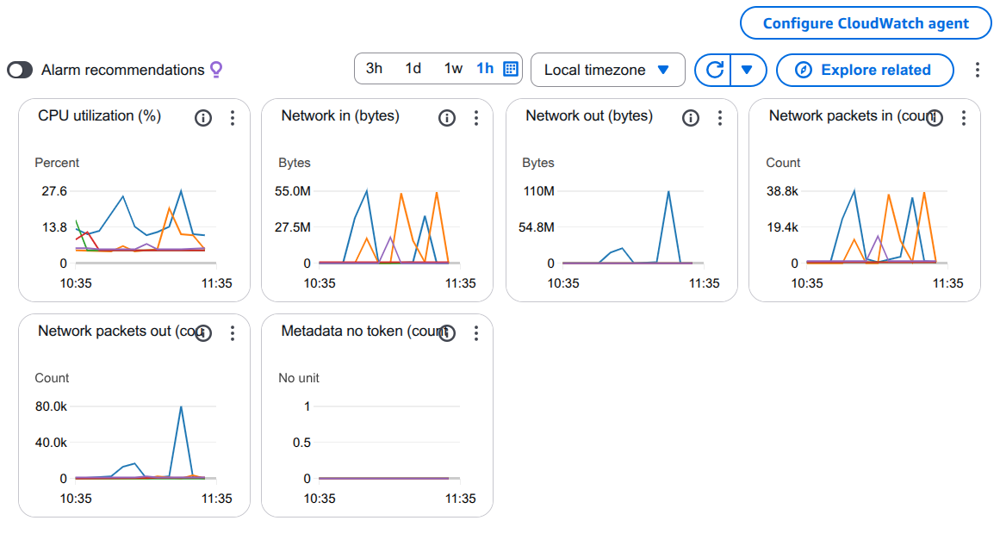

# Microservices Architecture 2025

> Enterprise-grade microservices system with Kubernetes orchestration for Library Management and E-Commerce Marketplace.

## 🏗️ Infrastructure

### Kubernetes Cluster on AWS EC2



**Cluster Specifications:**
- **Nodes:** 5 × AWS EC2 m7i.large
- **Per Node:** 2 vCPU, 8 GB RAM
- **Total Resources:** 10 vCPU, 40 GB RAM
- **Orchestration:** Kubernetes with DNS-based service discovery

---

## 🎯 Architecture Overview

### Core Components
- **11 Custom Microservices** - Business logic services
- **9 Official Images** - Infrastructure & monitoring
- **2 API Gateways** - Centralized routing
- **CQRS Pattern** - Event sourcing with H2 & MongoDB
- **Async Messaging** - RabbitMQ for inter-service communication

### Technology Stack
- **Backend:** Spring Boot 3.5.5, Spring Cloud 2025.0.0
- **Databases:** H2 (Command), MongoDB (Query)
- **Message Broker:** RabbitMQ
- **Service Discovery:** Eureka (display), Kubernetes DNS (actual)
- **Monitoring:** Prometheus + Grafana
- **Logging:** ELK Stack (Elasticsearch, Logstash, Kibana)
- **CI/CD:** Jenkins with Docker-in-Docker

---

## 🌐 Live Endpoints

### API Gateways
| Service | URL | Description |
|---------|-----|-------------|
| Perpustakaan Gateway | [perpustakaan-gateway.mooo.com](http://perpustakaan-gateway.mooo.com) | Library system API gateway |
| Marketplace Gateway | [marketplace-gateway.mooo.com](http://marketplace-gateway.mooo.com) | E-commerce API gateway |

### Library Services
| Service | URL | Function |
|---------|-----|----------|
| Buku | [bukuu.mooo.com](http://bukuu.mooo.com) | Book catalog & inventory |
| Anggota | [anggota.mooo.com](http://anggota.mooo.com) | Member management |
| Peminjaman | [peminjamann.mooo.com](http://peminjamann.mooo.com) | Borrowing transactions |
| Pengembalian | [pengembalian.mooo.com](http://pengembalian.mooo.com) | Return & fine processing |

### Marketplace Services
| Service | URL | Function |
|---------|-----|----------|
| Produk | [produk.mooo.com](http://produk.mooo.com) | Product management |
| Pelanggan | [pelanggan.mooo.com](http://pelanggan.mooo.com) | Customer accounts |
| Order | [orderr.mooo.com](http://orderr.mooo.com) | Shopping cart & orders |

### Infrastructure
| Service | URL | Purpose |
|---------|-----|----------|
| Jenkins | [jenkinss.mooo.com](http://jenkinss.mooo.com) | CI/CD automation |
| Grafana | [graffana.mooo.com](http://graffana.mooo.com) | Metrics visualization |
| Kibana | [kibbana.mooo.com](http://kibbana.mooo.com) | Log analytics |
| Eureka | [eurekaa.mooo.com](http://eurekaa.mooo.com) | Service registry |
| RabbitMQ | [rabbittmq.mooo.com](http://rabbittmq.mooo.com) | Message broker UI |
| H2 Console | [dbh2.mooo.com](http://dbh2.mooo.com) | Command database |
| Mongo Express | [dbmongo.mooo.com](http://dbmongo.mooo.com) | Query database |

---

## 📊 Service Inventory

### Custom Microservices (11)
1. **perpustakaan-gateway** - Library API gateway
2. **marketplace-gateway** - E-commerce API gateway
3. **buku** - Book service
4. **anggota** - Member service
5. **peminjaman** - Borrowing service
6. **pengembalian** - Return service
7. **produk** - Product service
8. **pelanggan** - Customer service
9. **order** - Order service
10. **cqrs** - Event sourcing service
11. **eureka-server** - Service registry

### Infrastructure Services (9)
- **RabbitMQ** - Message broker with Prometheus plugin
- **MongoDB** - NoSQL database with exporter
- **Mongo Express** - MongoDB admin UI
- **Elasticsearch** - Search & analytics engine
- **Logstash** - Log processing pipeline
- **Kibana** - Log visualization
- **Prometheus** - Metrics collection
- **Grafana** - Metrics dashboard
- **Jenkins + DIND** - CI/CD with Docker-in-Docker

---

## 🚀 Key Features

### Asynchronous Architecture
- **Service → RabbitMQ → CQRS** - Non-blocking command processing
- **CQRS → H2 → RabbitMQ → MongoDB** - Event-driven read model updates
- **Benefits:** High throughput, fault tolerance, eventual consistency

### Observability
- **Metrics:** All services expose Prometheus endpoints
- **Logs:** Centralized logging via Logstash to Elasticsearch
- **Tracing:** Service-level monitoring with Grafana dashboards

### DevOps
- **Auto-versioning:** Semantic versioning via commit messages
- **Multi-registry:** Docker Hub + GitHub Container Registry
- **Zero-downtime:** Rolling updates with Kubernetes

---

## 📁 Project Structure

```
.
├── perpustakaan/          # Library microservices
├── marketplace/           # E-commerce microservices
├── cqrs/                  # Event sourcing service
├── eureka/                # Service discovery
├── kubernetes-cluster/    # K8s manifests
├── jenkins/               # CI/CD configs & Unified Pipeline
├── elk/                   # ELK Stack configs
├── monitor/               # Prometheus & Grafana
└── docker-compose.yml     # Local development
```

---

## 🛠️ Quick Start

### Kubernetes Deployment
```bash
# Deploy PVC first
kubectl apply -f kubernetes-cluster/pvc.yaml

# Deploy all services
kubectl apply -f kubernetes-cluster/all-services-k8s.yaml
```

### Local Development
```bash
# Run with Docker Compose
docker-compose up -d
```

---

## 📝 License

MIT License - See [LICENSE](LICENSE) for details.