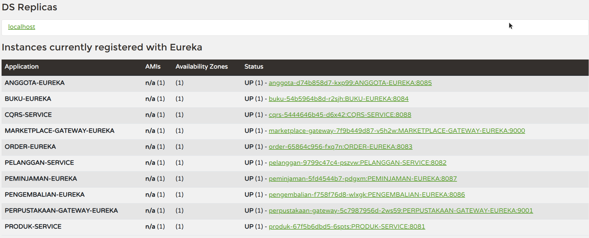

# Eureka Service Discovery

Eureka Server untuk service registry dan discovery (sebagai pajangan, actual discovery menggunakan DNS K8s).

## Dashboard Eureka

## Akses

- URL: http://eurekaa.mooo.com
- Port: 30761

## Registered Services

Total 11 services terdaftar:

**Perpustakaan (5):**
- BUKU-EUREKA
- ANGGOTA-EUREKA
- PEMINJAMAN-EUREKA
- PENGEMBALIAN-EUREKA
- PERPUSTAKAAN-GATEWAY-EUREKA

**Marketplace (4):**
- PRODUK-EUREKA
- PELANGGAN-EUREKA
- ORDER-EUREKA
- MARKETPLACE-GATEWAY-EUREKA

**Infrastructure (2):**
- CQRS-EUREKA
- EUREKA-SERVER

## Catatan

Eureka hanya sebagai **pajangan/monitoring**. Service discovery sebenarnya menggunakan **Kubernetes DNS** untuk komunikasi antar service.
