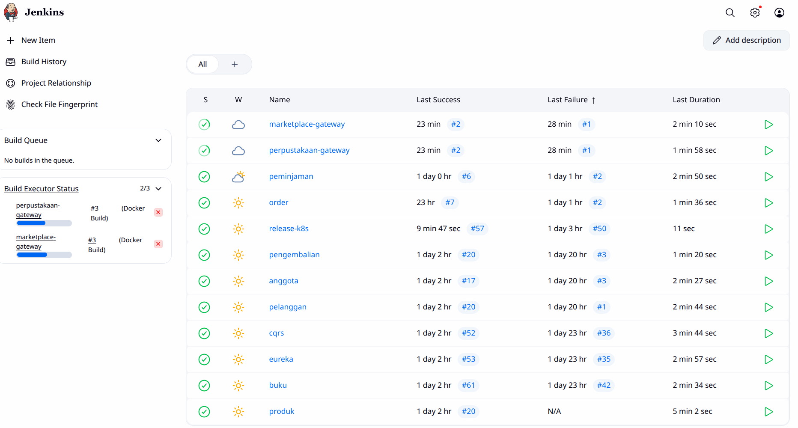

# Jenkins CI/CD

Jenkins server untuk automated build dan deployment microservices.

## Layout Jenkins

## Akses

- URL: http://jenkinss.mooo.com
- Port: 30000

## Services

Total 11 pipelines untuk build Docker images:

**Perpustakaan (5):**
- buku
- anggota
- peminjaman
- pengembalian
- perpustakaan-gateway

**Marketplace (4):**
- produk
- pelanggan
- order
- marketplace-gateway

**Infrastructure (2):**
- cqrs
- eureka

## Versioning

Commit message untuk auto-versioning:
- `[major]` - Major version bump (1.0.0 → 2.0.0)
- `[minor]` - Minor version bump (1.0.0 → 1.1.0)
- Default - Patch version bump (1.0.0 → 1.0.1)
